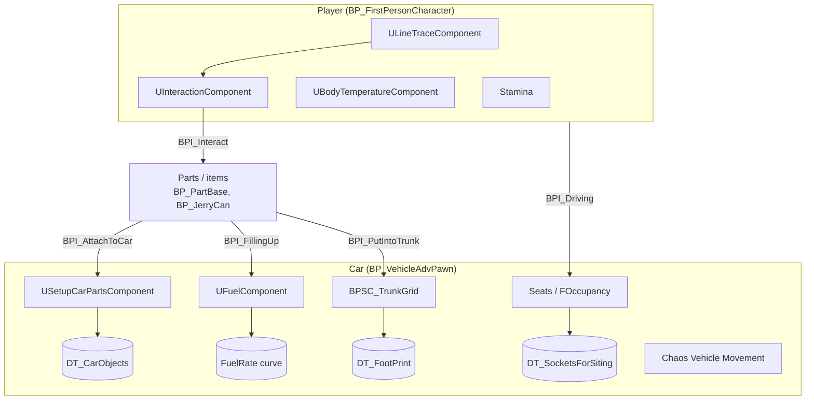
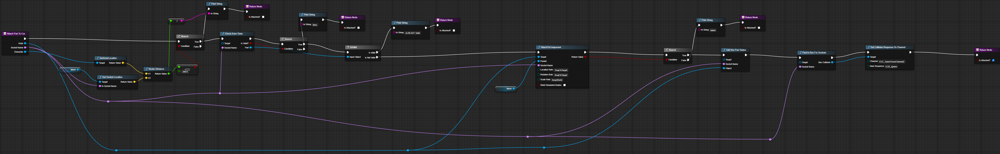
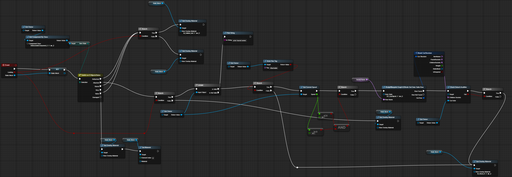
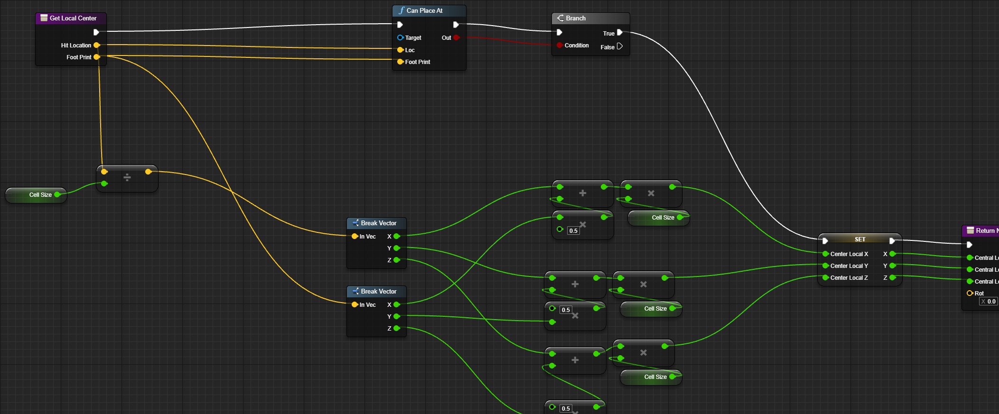
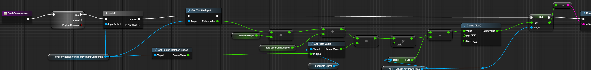
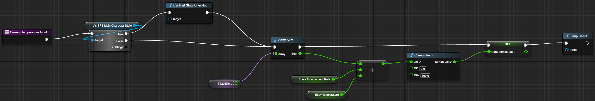
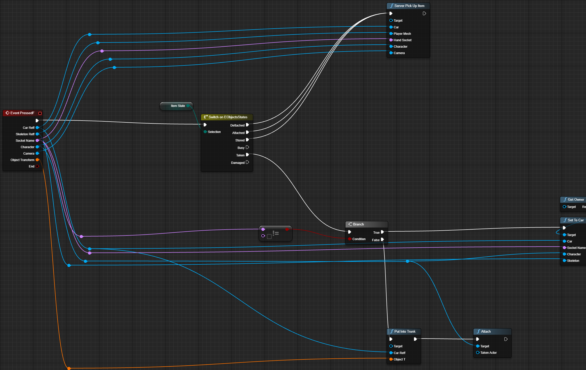

# 🚗❄️ The Last Car

**Co-op winter survival-driving game built in Unreal Engine 5**

*Formerly MyWinterDrive*

<!-- TODO: gameplay GIF, ~800px wide, < 10 MB -->

[Devlog](DevLogs/README.md) · [Systems](#%EF%B8%8F-systems) · [Blueprints](#-blueprint-showcase) · [Roadmap](#%EF%B8%8F-roadmap)

---

> [!NOTE]
> **This repository contains no project files.** The game is developed privately. This repo is a public window into development: how the systems work, selected Blueprint graphs, and a devlog.

## 📖 About

A frozen mountain road, one car and whatever you and your friends can bolt onto it. Pick up parts, fit them to the car, keep the tank from running dry and yourselves from freezing — and reach the end of the road together.

## ⚙️ Systems

Everything below is built in **Blueprints** and runs in co-op.

### 🔧 Car assembly
The car is not a single mesh — it's a chassis plus ~15 separate parts (doors, hood, bumpers, engine, wheels, seats, grilles, headlights), cut from the original model.
- `USetupCarPartsComponent` owns the car's configuration; which part goes into which socket is described in the `DT_CarObjects` data table
- Part state is stored in a struct (`FCarPartStates`), so the car can be rebuilt from data at any moment
- While carrying a part, the player sees a **ghost preview** at its socket — green when it fits, red when it doesn't
- Wheels can be removed and refitted at runtime; the Chaos vehicle picks up the change

### 🛞 Vehicle
- Chaos Wheeled Vehicle with a custom torque curve (`FC_Torque_MainCar`) and front/rear wheel setups
- Engine on/off, headlights (`UHeadLightComponent`), handbrake, camera toggle
- Working speedometer driven by its own Anim Blueprint
- **Async physics at a fixed 60 Hz with Physics Prediction enabled** — the base for smooth networked driving

### 🧍 Seats & getting in
- Seat sockets come from `DT_SocketsForSiting`; `FOccupancy` tracks who sits where
- Driver and passengers switch Input Mapping Contexts when they get in or out (`BPI_ChangeInput`)
- A separate Anim Blueprint for seated characters (`ABP_SitedCharacter`)

### 📦 Trunk
- The trunk is a **grid** (`BPSC_TrunkGrid`): each item has a footprint (`DT_FootPrint`) and takes a matching number of cells
- Stored items are kept as data (`FStoredItem`), not as physics actors rattling around in the car

### ⛽ Survival
- **Fuel:** `UFuelComponent` burns fuel along the `FuelRate` curve; refuel from a jerry can (`BP_JerryCan` + `BPI_FillingUp`)
- **Cold:** `UBodyTemperatureComponent` + `BFL_CountTemp` compute body temperature; cold slows the player down (`BPI_AffectColdOnSpeed`)
- **Stamina** for sprinting

### 🖐️ Interaction
- One interact key for everything: a line trace (`ULineTraceComponent`) finds the object, and the call goes through the `BPI_Interact` interface — the character doesn't need to know what it's looking at
- Object outline on hover (`M_Outliner`) and on-screen hints (`WBP_Take`, `WBP_SetToCar`)
- Separate LMB actions (`BPI_LMBInteraction`): pick up, drop, put into trunk

### 🗺️ World
- The MVP map is built on **real elevation data of Lofoten, Norway**
- A road from start to finish, with a finish trigger and end screen (`BP_Finish`, `WBP_FinishScreen`)

## 🏗️ Architecture

**Principle:** systems talk to each other through interfaces (`BPI_*`) rather than direct casts, and content lives in data tables. Adding a new part or item means a new table row and a child of `BP_PartBase` — no changes to the character or the car.

## 🧩 Blueprint Showcase

Selected graphs are hosted on [blueprintUE](https://blueprintue.com): open, zoom, copy nodes.

| System | Preview | Graph |
|---|---|---|
| Fitting a part to a socket |  | [blueprintUE](https://blueprintue.com/blueprint/3q0uuprv/) |
| Ghost preview (green / red) |  | [blueprintUE](https://blueprintue.com/blueprint/mncfdgby/) |
| Getting location to placing items in the trunk grid |  | [blueprintUE](https://blueprintue.com/blueprint/467y0wjt/) |
| Fuel consumption along a curve |  | [blueprintUE](https://blueprintue.com/blueprint/djc_v_-o/) |
| Body temperature |  | [blueprintUE](https://blueprintue.com/blueprint/2jx6_1hk/) |
| One key for everything: `BPI_Interact` |  | [blueprintUE](https://blueprintue.com/blueprint/32jk3nbi/) |

These are simplified excerpts; the current build may differ.

## 📰 Devlog

| # | Date | Entry |
|---|---|---|
| 001 | 2026-10-01 | [First two weeks: from template to MVP](DevLogs/001-first-two-weeks.md) |

→ [All entries](DevLogs/README.md)

## 🗺️ Roadmap

The plan changes as development goes on; this is the current version.

### ✅ M0 — Prototype · Aug 2026
- [x] Car model cut into separate parts (Blender)
- [x] Chaos vehicle: driving, torque curve, headlights, speedometer
- [x] Fitting parts to sockets from a data table, ghost preview
- [x] One key for everything through interfaces + Enhanced Input
- [x] Seats, getting in and out, switching input contexts
- [x] Grid-based trunk

### ✅ M1 — MVP · Sep 2026
- [x] Fuel and jerry can refueling
- [x] Body temperature, cold affects speed
- [x] Stamina / sprint
- [x] Map based on Lofoten, start → finish, finish screen

### 🔨 M2 — Vertical slice · *current*
- [ ] Co-op pass: parts, trunk and seats replicate correctly for every client
- [ ] Physics Prediction for the car in co-op (async physics is already enabled)
- [ ] Survival UI: temperature, fuel and stamina widgets in sync across all players
- [ ] Battery drain and oil freezing: state formulas that depend on the cold
- [ ] Parts moved from data tables to Data Assets, so 100+ parts stay easy to manage

### ❄️ M3 — World & atmosphere
- [ ] Icing shader for the car and glass
- [ ] Niagara blizzard
- [ ] PCG: forests and props along the road without placing them by hand
- [ ] Sound: engine, wind, snow crunch

### 💾 M4 — Persistence & polish
- [ ] Save system: the state of every part and item in the world
- [ ] Co-op bug hunt, playtests
- [ ] Moving performance-critical systems to C++
- [ ] First public build / Steam page

## 🕰️ Timeline

| Date | Milestone |
|---|---|
| 2026-08-26 | Project started from the UE5 First Person + Vehicle templates |
| 2026-08-31 | Jerry can and refueling: the core loop works end to end |
| 2026-09-10 | MVP map finished |
| 2026-10-01 | Renamed from MyWinterDrive to **The Last Car**; public devlog started |

## 🛠️ Tech Stack

**Engine:** Unreal Engine 5 · **Logic:** Blueprints (interface-driven, data tables) · **Physics:** Chaos Vehicles, async physics, Physics Prediction · **Input:** Enhanced Input · **Animation:** Anim Blueprints, Control Rig · **Art:** Blender · **Terrain:** real heightmap data

## 📬 Contact

**Igor** — game developer, KBTU GameLab (Almaty)

- Portfolio: [kashtan.online](https://kashtan.online)
- Telegram: [Igor](https://t.me/galooshiii)
---

© 2026 Igor. All rights reserved. Screenshots, videos and Blueprint excerpts are shared for showcase purposes only.

